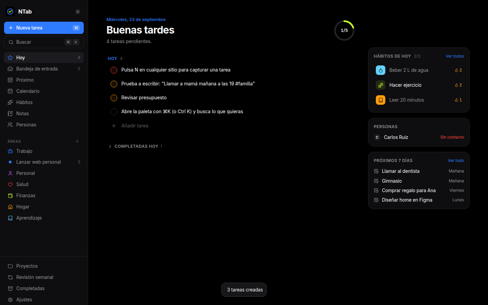
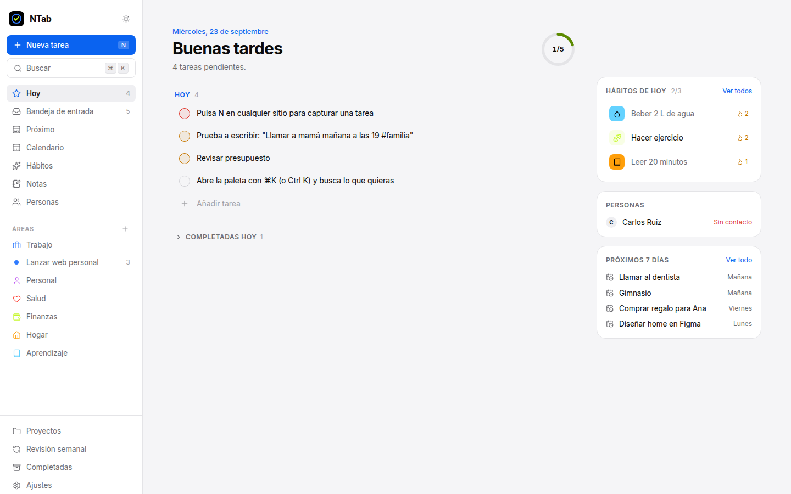
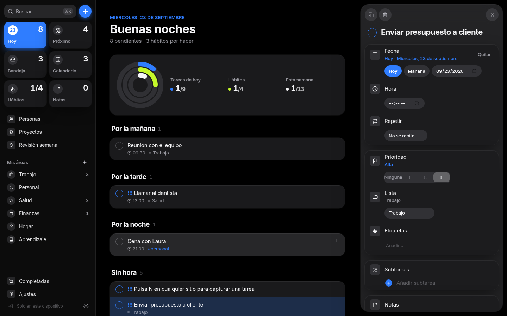
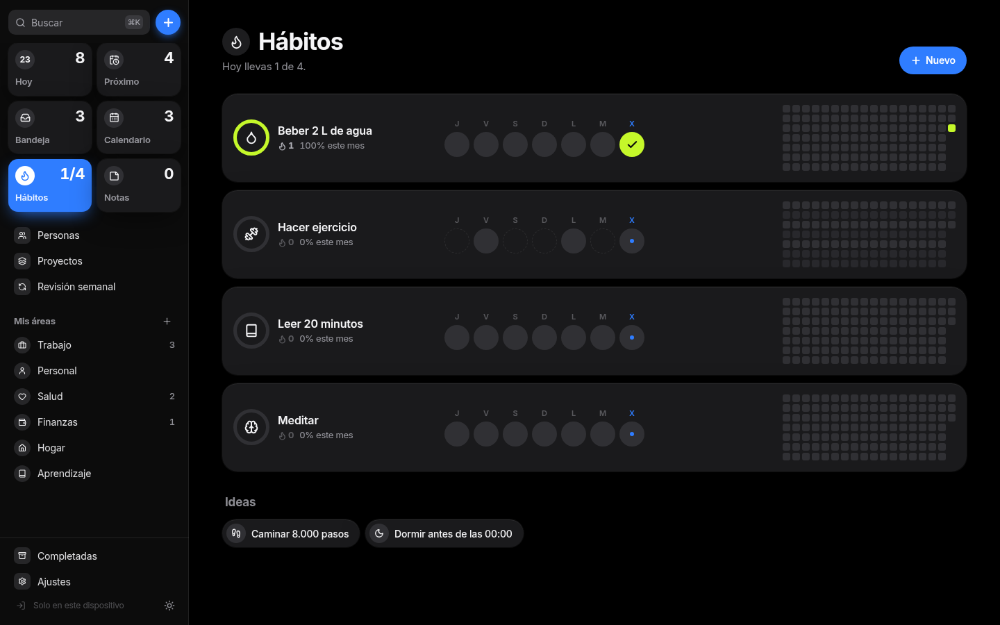
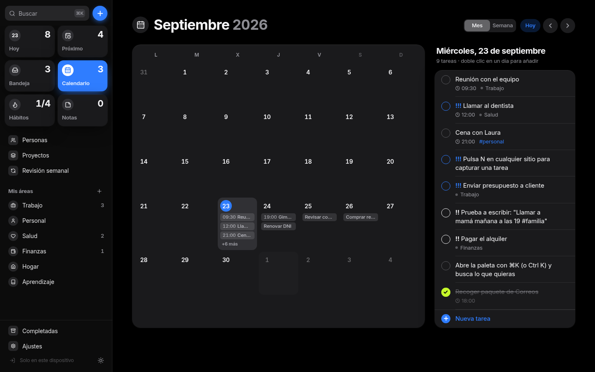
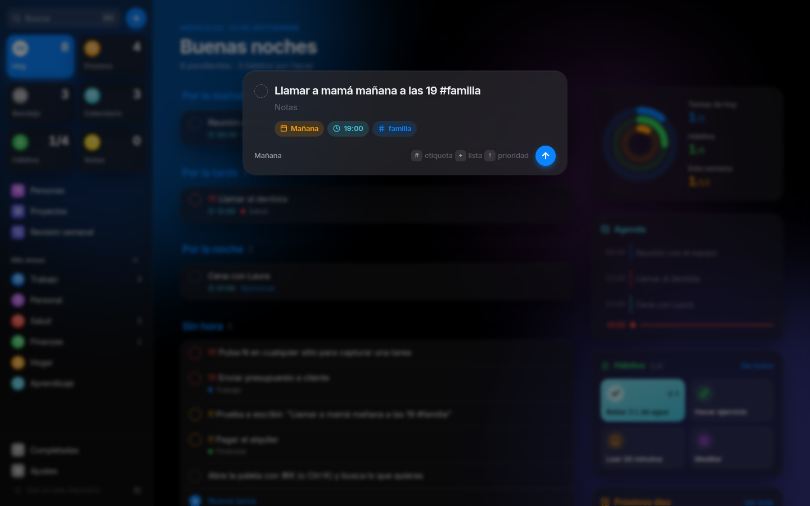
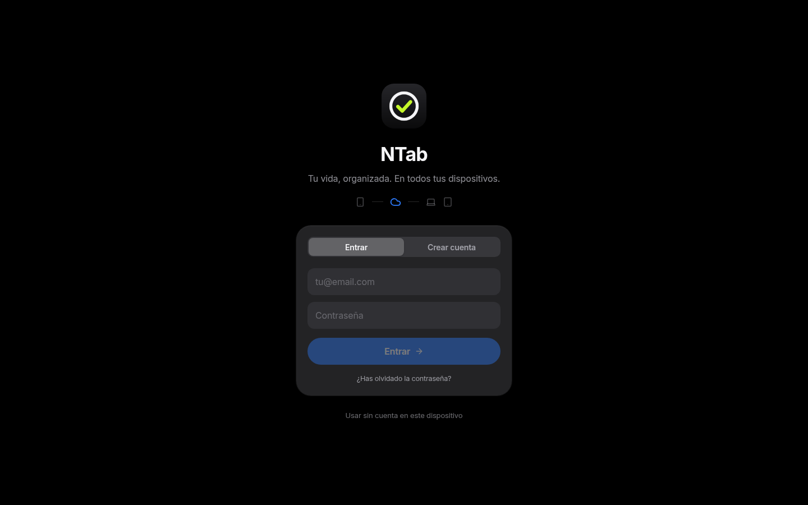
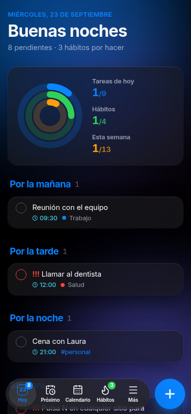

# NTab

**Tu vida, organizada.** Una herramienta personal para gestionar tareas, trabajo, proyectos, hábitos, notas y personas en un solo sitio. Pensada para despistados: captura en 2 segundos, olvídate, y deja que la app se acuerde por ti.



## Qué hace

| | |
|---|---|
| **Hoy** | Saludo, progreso del día, atrasadas, hábitos de hoy, personas a contactar y próximos 7 días |
| **Captura rápida** (`N`) | Escribe en español natural: `Llamar al dentista mañana a las 10 !alta #salud +Salud` |
| **Bandeja de entrada** | Todo lo capturado sin fecha ni proyecto, para procesarlo luego |
| **Próximo** y **Calendario** | Vista de dos semanas, mes y semana; doble clic en un día para añadir |
| **Áreas y proyectos** | Trabajo, Salud, Finanzas… con proyectos, progreso y fecha límite |
| **Tareas completas** | Prioridad, fecha, hora, repetición, subtareas, etiquetas y notas |
| **Hábitos** | Seguimiento diario, rachas 🔥 y mapa de calor de 18 semanas |
| **Notas** | Autoguardado; las líneas `- [ ] algo` se convierten en tareas con un clic |
| **Personas** (mini-CRM) | Cumpleaños, historial de contactos y aviso de "hace mucho que no hablas con…" |
| **Revisión semanal** | Asistente de 6 pasos para vaciar la cabeza y planificar la semana |
| **Avisos** | Cada tarea puede avisarte (a la hora, minutos antes o cuando quieras), también con la app cerrada. Botones «Hecho» y «Posponer 15 min» |
| **Resumen de la mañana** | Una notificación diaria, a la hora que elijas, con lo que tienes hoy |
| **Planificar el día** | Un minuto por la mañana: lo atrasado, la bandeja y lo que viene, a hoy o a otro día |
| **Modo foco** | Temporizador a pantalla completa con la tarea y sus subtareas; avisa al terminar |
| **Plantillas** | Listas que repites (maleta, cierre de mes…): se crean las tareas con sus fechas, como proyecto o sueltas |
| **Papelera** | Lo que borras se guarda 30 días y se puede recuperar |
| **Tu semana** | En Completadas: tareas por día, tiempo de foco, hábitos y racha |
| **Personas en tareas** | Escribe `@Ana` al capturar: la tarea aparece en su ficha como «Pendiente con Ana» |
| **Recordatorio de hábitos** | Cada hábito puede avisarte a una hora si aún no lo has hecho (con botón «Hecho») |
| **Repeticiones** | «Cada 3 días desde que la haga» cuenta desde que la completas; «Saltar esta vez» pasa a la siguiente |
| **Arrastrar** | En Calendario y Próximo, arrastra una tarea a otro día (en el móvil, pulsación larga) |
| **Claude** | Conector para usar NTab desde Claude con tu suscripción: «¿qué tengo esta semana?», «planifícame el día», «apunta lo de este email» |
| **Calendario** | Suscríbete desde Calendario del iPhone, Google u Outlook y verás tus tareas, pagos y cumpleaños |
| **Objetivos** | Metas medidas con una cifra (12 libros) o con sus proyectos, y si vas bien de tiempo |
| **Pagos** | Suscripciones y recibos: cuánto pagas al mes y al año, y aviso antes de cada cargo |
| **Paleta** (`⌘K`) | Busca cualquier cosa y ejecuta cualquier acción |
| **Tema** | Oscuro (por defecto), claro o del sistema |
| **Sincronización** | Con tu cuenta, los datos están en el iPhone, el iPad y el ordenador, al momento |
| **Funciona sin conexión** | Cada dispositivo guarda una copia local; los cambios se suben al volver la conexión |
| **Instalable** | Se añade a la pantalla de inicio del iPhone/iPad sin App Store |

<p>
  
  
  
  
  
  
</p>



## Diseño

Minimalista y monocromo, con los patrones de Recordatorios, Fitness y Ajustes de Apple. Detalles en [docs/DESIGN.md](docs/DESIGN.md).

- **Blanco, negro y grises.** Solo **azul eléctrico** para actuar (hoy, selección, botones) y **verde lima** para lo hecho.
- **Listas agrupadas**, títulos grandes, anillos de progreso y SF Pro en los dispositivos de Apple.
- **Movimiento con física:**
  - arranque animado;
  - transiciones entre vistas;
  - casillas que se rellenan con un muelle;
  - hojas que se cierran arrastrando.

## Lenguaje natural

| Escribes | Entiende |
|---|---|
| `hoy`, `mañana`, `pasado mañana`, `el viernes`, `el 15`, `15/10`, `3 de marzo`, `en 2 semanas`, `la semana que viene` | Fecha |
| `a las 10`, `17:30`, `9am`, `a las 7 de la tarde`, `al mediodía` | Hora |
| `!alta` `!media` `!baja`, `!1` `!2` `!3`, `!!!` | Prioridad |
| `#etiqueta` | Etiqueta |
| `+Proyecto` o `+Área` | Dónde va (coincidencia aproximada) |
| `@Ana` | Persona relacionada |
| `cada día`, `cada lunes y jueves`, `cada 2 semanas`, `el 1 de cada mes`, `días laborables` | Repetición |
| `avísame`, `recuérdamelo 1 día antes`, `con aviso 30 minutos antes` | Aviso |
| `cada 3 días desde que la haga` | Repetición contada desde que se completa |

## Atajos

`N` nueva tarea · `⌘K` / `Ctrl K` buscar · `G` + `H`/`I`/`U`/`C`/`B`/`O`/`P`/`J`/`T`/`F`/`R`/`S` ir a sección · `?` ayuda · `Esc` cerrar

## En el iPhone o el iPad

1. Abre la web de NTab en **Safari**.
2. Pulsa **Compartir** → **Añadir a pantalla de inicio**.
3. Ábrela desde el icono y entra con tu cuenta.

## Sincronización

- Supabase guarda cada registro en la tabla `records` (JSON por registro), protegida con RLS: cada usuario solo ve sus filas.
- La app sigue trabajando contra IndexedDB. Un middleware de Dexie apunta cada cambio en un *outbox*; el motor (`src/sync/engine.ts`) sube lo pendiente, descarga lo nuevo desde la última vez y escucha cambios en tiempo real.
- Primera vez en un dispositivo: si la nube está vacía se suben sus datos; si no, se descargan (o se combinan, si el dispositivo tenía datos propios).
- Las migraciones están en `supabase/migrations/` y la integración de GitHub de Supabase las aplica al fusionar en `main`.

## Avisos con la app cerrada

- Cada tarea (y cada pago) guarda el momento de su aviso (`remindAt`), que viaja con la sincronización.
- Cada minuto, `pg_cron` llama a la Edge Function `send-reminders` (`supabase/functions/`), que busca los avisos pendientes con `due_reminders()` y los envía por Web Push a los dispositivos suscritos.
- Con la app abierta (`src/reminders/local.ts`), el aviso sale dentro de la app, como notificación del sistema y con sonido. El push del servidor para ese mismo aviso ya no vuelve a sonar en ese dispositivo (`public/push-sw.js`).
- En el iPhone hacen falta iOS 16.4 o posterior y la app añadida a la pantalla de inicio. Se activan en **Ajustes → Avisos**.
- Configuración única en Supabase: el secreto `VAPID_PRIVATE_KEY` de la Edge Function (la clave pública está en `src/reminders/push.ts`).

## Claude y calendario

- **Conector para Claude** (`supabase/functions/mcp`): servidor MCP por HTTP. Cada usuario tiene una URL privada (`mcp_connectors.token`) que se crea en Ajustes → Claude y se añade en Claude → Ajustes → Conectores → Añadir conector personalizado. Se usa con la suscripción de Claude, sin claves de API.
  - Herramientas: `ver_resumen`, `buscar_tareas`, `crear_tareas`, `actualizar_tareas`, `crear_nota`, `marcar_habito`, `crear_proyecto`, `actualizar_objetivo`, `registrar_contacto`, `marcar_pago`, `ver_plantillas` y `usar_plantilla`.
  - Escribe en `records` con el mismo formato que la app (avisos automáticos y tareas que se repiten incluidos), así que los cambios llegan a los dispositivos por la sincronización en tiempo real.
- **Calendario** (`supabase/functions/calendar`): enlace privado por usuario (`calendar_feeds.token`) que sirve un `.ics` con tareas con fecha, pagos y cumpleaños. Se crea y se cambia en Ajustes → Calendario.
  - Google Calendar tarda horas en refrescar los calendarios suscritos. Para tenerlo al día (también lo que se borra), Ajustes → Calendario → Google Calendar da un script de Google Apps Script (`src/features/settings/googleScript.ts`). Se pega en script.google.com y cada 5 minutos lee `?format=json` y crea, cambia o borra los eventos del calendario «NTab».
- **Resumen de la mañana**: `due_digests()` + `send-reminders`, con la hora guardada en el ajuste `dailyDigest`.

## Desarrollo

```bash
npm install
npm run dev        # servidor de desarrollo
npm test           # tests (lenguaje natural, repeticiones, rachas, sincronización, avisos, pagos, calendario, conector de Claude)
npm run build      # typecheck + build de producción en dist/
npm run preview    # sirve el build
```

**Stack:** Vite · React 19 · TypeScript · Tailwind CSS v4 · Motion · Dexie (IndexedDB) · Supabase · date-fns · lucide · cmdk · vite-plugin-pwa · Vitest.

Se publica en Vercel (`vercel.json`). La URL y la clave pública de Supabase están en `src/sync/supabase.ts` y se pueden sobrescribir con `VITE_SUPABASE_URL` / `VITE_SUPABASE_ANON_KEY`.

## Plan

La planificación completa (principios, módulos, modelo de datos, diseño y hoja de ruta) está en [docs/PLAN.md](docs/PLAN.md).
