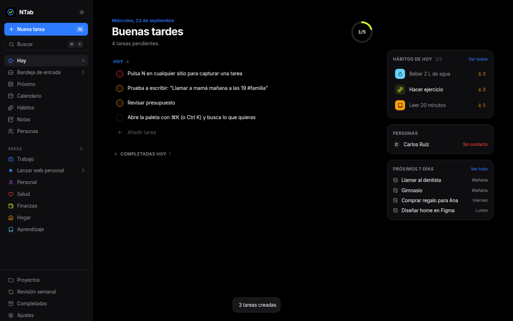
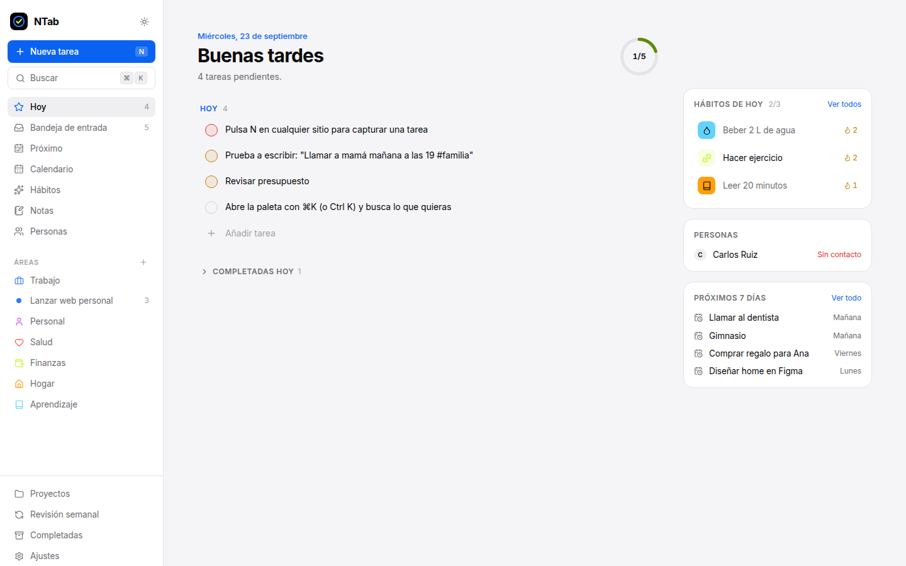
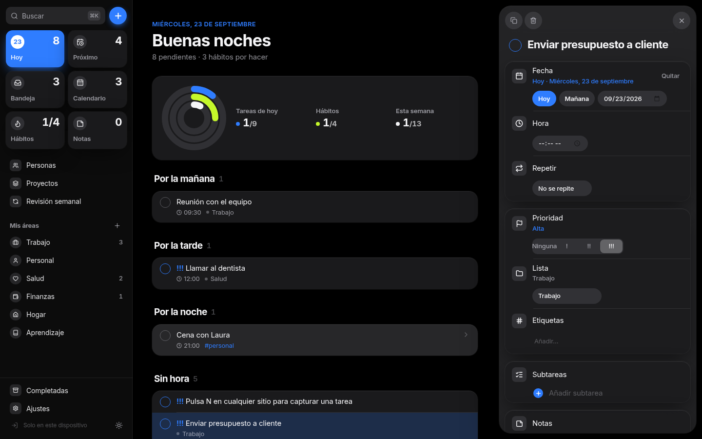
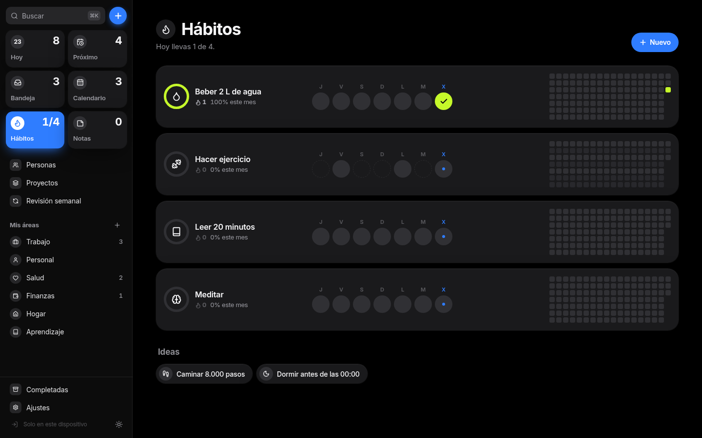
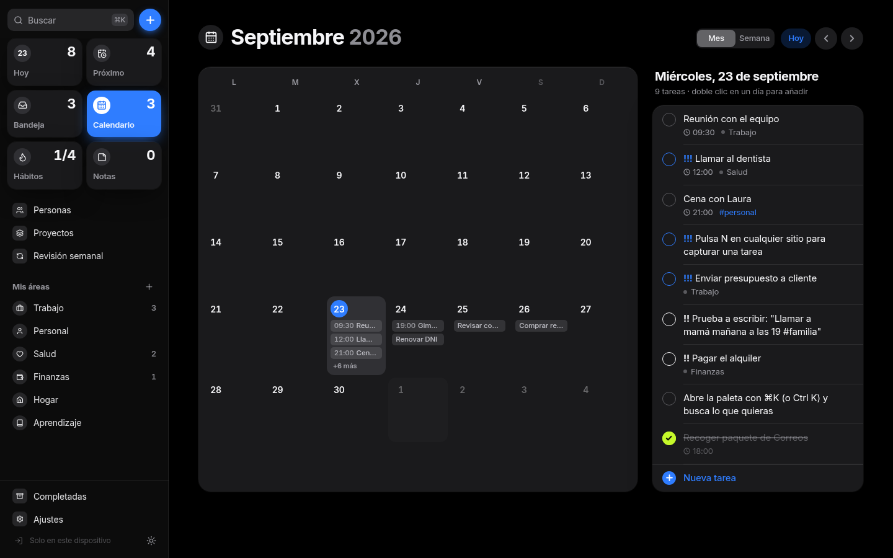
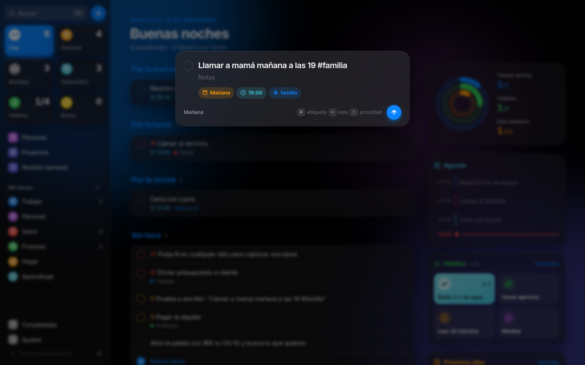
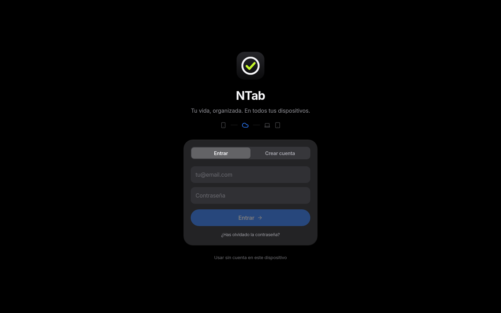
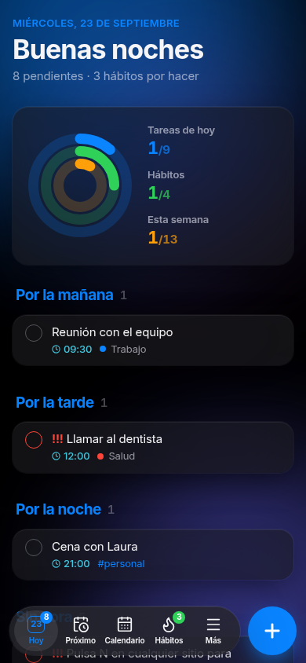

<p>
  <picture>
    <source media="(prefers-color-scheme: dark)" srcset="docs/brand/luno-lockup-dark.svg">
    
  </picture>
</p>

**Tu sistema personal.** Un solo lugar para tareas, proyectos, hábitos, notas, calendario, foco, finanzas y personas, conectados entre sí. Pensado para despistados: captura en 2 segundos, olvídate, y deja que LUNO se acuerde por ti.



## Qué hace

| | |
|---|---|
| **Hoy** | Saludo, progreso del día, atrasadas, hábitos de hoy, personas a contactar y próximos 7 días. **Lo importante** (como los objetivos del día de Sunsama): hasta 3 tareas arriba del todo, elegidas en Hoy, en Planificar, en el cierre del día o con «★ Importante hoy» en el detalle. **Objetivo diario y racha** (como Todoist): cuántas tareas al día, días seguidos cumpliéndolo y días libres que no la rompen. Las tareas que se arrastran dicen «Pospuesta 4 veces» |
| **Captura rápida** (`N`) | Escribe en español natural: `Llamar al dentista mañana a las 10 !alta #salud +Salud`. **Pega una lista** (de Notas, un correo, Markdown) y sale una tarea por línea, cada una con su fecha (como en Things). **Pega un enlace** y la tarea se llama como la página (con cuenta; sin ella, con la dirección legible) y el enlace va a las notas; en la lista se ve el dominio y se abre con un toque (como en Todoist). **Entiende lo mismo que Siri**: «compra leche y pan» va a la compra, «gasto 12,50 comida con Ana» a gastos, «nota: …» a notas, «+1 agua» al hábito, «hecho: llamar al dentista» completa la tarea y «he dejado las llaves en el cajón» va a tus cosas; antes de guardar se ve a dónde va, y se puede deshacer |
| **Compartir con LUNO** | Desde cualquier app, «Compartir → LUNO»: en Android y con la app instalada en el ordenador sale entre las apps de compartir y abre la captura con el título y el enlace; en el iPhone, con el atajo «Enviar a LUNO» de la hoja de compartir (Ajustes → Claude y Siri), que lo apunta en la Bandeja sin abrir la app y lee el título de la página |
| **Traer de otra app** | Ajustes → Tus datos: el CSV de cada proyecto de **Todoist** (con secciones, subtareas, comentarios, etiquetas, prioridad y fechas, también en inglés: «every monday», «tomorrow at 10am»), la copia de seguridad de **TickTick** (listas, columnas, listas de comprobación, fechas en su zona horaria, repeticiones y subtareas), **Google Tasks** (Google Takeout) o cualquier lista pegada (Recordatorios, Notas, Microsoft To Do). Vista previa antes de traer, las ya hechas solo si quieres y «Deshacer» |
| **Bandeja de entrada** | Todo lo capturado sin fecha ni proyecto, para procesarlo luego |
| **Calendario** | Vistas Lista (lo que antes era Próximo: lo atrasado, dos semanas día a día con los días libres en una línea y lo de más adelante), día, semana y mes; doble clic en un día para añadir. **Semana por horas** en pantallas grandes (como Google Calendar o Fantastical): reuniones y tareas en su hora, que se arrastran a otra hora u otro día o se alargan tirando del borde, y las tareas sin hora se arrastran desde arriba a un hueco (el «timeboxing» de Akiflow o Sunsama). **Día hora a hora** para cualquier día; tocar un hueco crea una tarea a esa hora. Una barra fina en cada día dice cuánto hay (tareas estimadas y reuniones frente a 6 h, como la capacidad de Motion o Reclaim). **Todo lo que tiene fecha**, cada cosa en su día: además de tareas, reuniones y cumpleaños, las fechas límite de tareas y proyectos, los cargos de tus pagos (y el fin de las pruebas gratis) y las cuentas atrás |
| **Áreas y proyectos** | Trabajo, Salud, Finanzas… con proyectos, progreso, fecha límite y su siguiente paso a la vista. **Ninguno se queda olvidado**: cada proyecto dice si va con retraso, justo de fecha, sin siguiente paso o parado dos semanas (en su tarjeta y arriba en su página, con lo que se puede hacer ya: añadir el siguiente paso, traerlo a hoy, pausarlo o terminarlo), y al planificar el día salen los siguientes pasos de los que no tienen nada esa semana |
| **Todo conectado** | Lo que haces en un sitio se nota en los demás. Al hacer una tarea con `@Ana`, queda como contacto con Ana (su último contacto, para «hace mucho que no hablas con…»); si es algo de «Última vez» («Cambiar las sábanas»), se apunta allí; si salió de una nota, se marca su casilla; si cuenta para un objetivo por su #etiqueta, te dice cuánto llevas; y si era la última de un proyecto, te propone terminarlo (y su objetivo avanza). Deshacer lo deshace todo. Igual desde Claude y Siri |
| **Secciones** | Divide un proyecto en bloques («Diseño», «Contenido», «Lanzamiento»), cada uno con su orden; las plantillas y Claude también las usan |
| **Tablero** | Cualquier proyecto se ve en lista o en tablero (como Trello o Asana): cada sección es una columna y las tarjetas se arrastran de una a otra (o «Mover a…» sin ratón). Se recuerda por proyecto |
| **Fecha límite** | Además de *cuándo* hacerla, *para cuándo* tiene que estar (como en Things y Todoist): «antes del viernes», «como muy tarde el 3». Sale en Hoy cuando llega, te avisa la víspera y el mismo día (a la hora que elijas en Ajustes → Avisos) y se marca si se pasa |
| **Algún día** | Lo que no es para ahora pero no quieres olvidar (como en Things y GTD): fuera de la Bandeja y de Hoy, con su propia lista y paso en la revisión semanal. `S` en una lista, «algún día» al escribir |
| **A la espera** | Lo que depende de otra persona (el «A la espera» de GTD, como en OmniFocus o Things): escribe «esperando a Luis» al capturar («Presupuesto del fontanero esperando a Luis») o, en una tarea, «A la espera de alguien». Sale de Hoy y vuelve en 3 días (o el día que digas) con cuánto lleva esperando; «Recordárselo» le escribe por WhatsApp si tiene su móvil en Personas (o lo copia, o abre compartir) con todo lo que esperas de él, y lo vuelve a mirar en 3 días sin contar como pospuesta (como el «avísame si no contesta» de Boomerang). Por persona en Bandeja → A la espera, en su ficha y en la revisión semanal |
| **Listas** | Un solo sitio para lo que no es de hoy ni de un proyecto: **Algún día**, **A la espera**, **Completadas** y la **Matriz**, con su recuento, y debajo tus **filtros** (búsquedas guardadas que se actualizan solas, como los de Todoist o TickTick: por fecha, prioridad, etiquetas, proyecto o área, persona y duración; también en la barra lateral, en «Mis filtros») y tus **etiquetas** |
| **Matriz de Eisenhower** | Lo pendiente en cuatro cuadrantes (urgente/importante, como en TickTick); arrastrar a otro cuadrante cambia la prioridad o la fecha |
| **Tareas completas** | Prioridad, fecha, hora, repetición, subtareas, etiquetas y notas |
| **Hábitos** | Seguimiento diario, rachas 🔥 y mapa de calor de 18 semanas. Con cantidad («8 vasos de agua», con botón +1) o «3 veces por semana», el día que quieras. **Fuerza del hábito** (como Loop: un fallo suelto apenas la baja) y mejor racha; **pausa** para vacaciones o enfermedad y «hoy no toca» (como Streaks) sin romper la racha ni avisar |
| **Notas** | Autoguardado, agrupadas como en Notas de Apple (fijadas, hoy, ayer, 7 y 30 días, por mes); las líneas `- [ ] algo` pasan a tareas con un clic («Pasar la lista a tareas», con sus fechas y @personas) y quedan **enlazadas**: hacer la tarea marca su casilla y marcar la casilla hace la tarea; debajo de la nota, «Tareas de esta nota», y en la tarea, «De la nota…». **Enlazadas** como en Bear u Obsidian: `[[Otra nota]]` (con sugerencias al escribir), «Mencionada en» y `#etiquetas` para filtrar; al cambiar el título de una nota, sus enlaces cambian con ella. **Con formato** (como Bear): títulos, negrita, listas, citas y enlaces, con barra para escribirlos y Intro que sigue la lista; se abren para leer y un toque pasa a escribir. **Casillas que se marcan** (como Notas de Apple), con «Marcadas al final» y «Desmarcar todo» para las listas que se repiten (la maleta). **Fotos**, **plantillas** (reunión, maleta, idea, lista) y **nota del día** (como Obsidian), y **compartir** en Markdown |
| **Personas** (mini-CRM) | Cumpleaños, historial de contactos y aviso de "hace mucho que no hablas con…". Como en Monica o Clay: **fechas importantes** que vuelven cada año (aniversarios, santos…) con aviso en Hoy, e **ideas de regalo** que se marcan al regalarlas |
| **Revisión semanal** | Asistente paso a paso para vaciar la cabeza y planificar la semana, con «Algún día» y proyectos marcados como revisados (como en OmniFocus) |
| **Avisos** | Cada tarea puede avisarte (a la hora, minutos antes o cuando quieras), también con la app cerrada. Botones «Hecho» y «Posponer 15 min» |
| **Resumen de la mañana** | Una notificación diaria, a la hora que elijas, con lo que tienes hoy |
| **Planificar el día** | Desde Hoy (la sugerencia de la mañana o el menú «⋯»). Un minuto: lo atrasado, la bandeja y lo que viene, a hoy o a otro día, y elegir lo importante. A lo que lleva 3 veces pospuesto se le propone «Algún día» |
| **Cerrar el día** | Por la tarde (como el cierre de Sunsama): lo que has hecho, qué pasa con lo que queda (mañana, algún día o hecha, sin arrastrarlo sin pensar), qué tal el día para el diario y un vistazo a mañana con lo importante ya elegido. Hoy lo propone a partir de las 18:00 |
| **Foco** | Temporizador a pantalla completa con la tarea y sus subtareas, o con lo que vayas a hacer (foco libre). **Pomodoros con descansos** (5 min tras cada uno y 15 cada cuatro, como Focus To-Do) con qué hacer en el descanso; **apuntar algo para luego** sin dejar el foco (va a la Bandeja, como la lista de imprevistos de la técnica Pomodoro); **sonido de fondo** (ruido marrón, rosa, blanco u olas, generado al momento, como Noisli o Endel); y al acabar, **¿qué tal ha ido?** (como Session). La página Foco (`G` `Q`) tiene el **objetivo diario con racha** (Forest), los últimos 14 días, **tus mejores horas** (Rize) y en qué se va el tiempo; cada tarea dice cuánto foco lleva frente a lo estimado (Toggl) |
| **Plantillas** | Listas que repites (maleta, cierre de mes…): se crean las tareas con sus fechas, como proyecto o sueltas |
| **Papelera** | Lo que borras se guarda 30 días y se puede recuperar |
| **Tu semana** | En Completadas: tareas por día, tiempo de foco, hábitos y racha |
| **Personas en tareas** | Escribe `@Ana` al capturar: la tarea aparece en su ficha como «Pendiente con Ana» |
| **Recordatorio de hábitos** | Cada hábito puede avisarte a una hora si aún no lo has hecho (con botón «Hecho») |
| **Repeticiones** | «Cada 3 días desde que la haga» cuenta desde que la completas; «Saltar esta vez» pasa a la siguiente |
| **Tus calendarios** | Conecta Google, iCloud u Outlook (su dirección .ics) y tus reuniones salen en la Agenda de Hoy, en el Calendario y al planificar el día |
| **Duración y carga del día** | `~30m`, `~1h30` al escribir: la Agenda y «Planifica tu día» suman tareas y reuniones y avisan si el día no cabe |
| **Selección múltiple** | «Seleccionar» en las listas (o `⌘`/`Ctrl` + clic): mueve a hoy, mañana o una fecha, cambia lista o prioridad, completa o borra varias a la vez |
| **Avisos insistentes** | «insísteme» o «hasta que lo haga»: el aviso se repite cada 10 minutos (o lo que elijas) hasta que la marcas, también con la app cerrada |
| **Rutinas** | Listas de pasos que haces siempre igual («Antes de salir de casa»: llaves, cartera, móvil…). Te avisa a su hora y te guía paso a paso a pantalla completa; con **minutos por paso** (como Routinery), cuenta atrás que suena al acabar y la hora a la que terminas |
| **Cosas** | Dónde guardaste algo (con foto), qué has prestado y a quién, qué te han prestado y qué caduca (DNI, ITV…), con avisos. Búsqueda «¿Dónde está…?». **Inventario de casa** (como Sortly o Encircle): estancia, fecha y precio de compra, foto del ticket y **garantía** («2 o 3 años desde la compra» en un toque) con aviso un mes antes de que acabe; vista «Por estancia» y lo que vale todo lo apuntado |
| **Tareas de casa y piso compartido** | En Casa → Tareas: las tareas de casa que se repiten van **por turnos** (como Flatastic o Sweepy): sacar la basura cada 2 días, el baño cada semana… y cuando alguien la hace, le toca al siguiente; las sueltas («llamar al casero») para quien pueda. «Te toca» arriba y en Hoy, y el **reparto** del último mes. Si vives con más gente, invítala con un **enlace: no necesitan cuenta ni instalar nada**, eligen quién son y ven lo mismo al momento. Les llega un **aviso al móvil** a las 9:00 con lo que les toca y a las 20:00 si sigue sin hacer (también sin cuenta), y el piso se abre **directamente desde su pantalla de inicio** (con cómo añadirlo en el iPhone). Con el piso tenéis también la **compra del piso** (la lista «Piso» de Compra, con quién apuntó y quién compró cada cosa, como Bring!; dictada, con «lo de siempre», precios y total estimado, y desde Siri con «piso: leche y pan») y las **cuentas del piso** (como Splitwise: gastos a partes iguales, quién debe a quién y cómo saldarlo con los menos pagos; tu parte de cada gasto entra en tus Gastos con #piso). Y la **limpieza por estancias** (como Tody o Sweepy): cada tarea con una barra que se ensucia según pasan los días, agrupadas por estancia, con «Lo típico de cocina, baño…» para empezar y «Hecho hoy» en un toque; es tuya, también sin piso |
| **Compra** | Escribe o dicta todo de golpe («leche, 2 barras de pan y detergente»): cada cosa va a su pasillo, con cantidades, «lo de siempre» y «Terminar compra». **Varias listas** (Súper, Farmacia, Ferretería…) y **precio estimado** (como AnyList): «leche 1,20 €» o un toque en «€»; LUNO recuerda lo que costó y suma lo que llevas y lo que falta |
| **Última vez** | ¿Cuándo cambiaste las sábanas o fuiste al dentista? Un toque para apuntarlo; si le pones «cada N días», te avisa cuando toca. Y **«Días sin…»** para lo que quieres dejar (como Quitzilla): días seguidos, récord, siguiente meta y dinero ahorrado. Va en Hábitos, debajo de los de cada día; la limpieza por estancias vive en Casa → Tareas |
| **Medicación** | Como Medicamentos de Apple Salud o Medisafe: cada pastilla con su dosis, sus horas y sus días (o «cuando haga falta», con máximo al día), y tratamientos de N días («día 3 de 7»). Hoy, en Hábitos → Medicación y en una tarjeta de Hoy: **«Tomada» en un toque y a qué hora**, para no volver a dudar de si te la has tomado. A la hora te avisa (también con la app cerrada, con «Tomada» en el propio aviso) y, si no la marcas, **insiste a los 15 y a los 30 minutos**. Lleva la cuenta de **lo que queda en la caja** y avisa cuando queda para una semana: a la compra (a la lista de la farmacia si la tienes) o «Caja nueva». Y cómo has cumplido las dos últimas semanas |
| **Diario** | Un minuto al día: ánimo, unas líneas y tres cosas buenas; lo que hiciste se apunta solo. Racha, tendencia y mapa de ánimo; **«Tal día como hoy»** (como Day One), **año en píxeles** y **«Lo que te sienta bien»**: el ánimo de los días que haces cada hábito frente a los que no (como Daylio) |
| **¿Qué hago ahora?** | Dices cuánto tiempo tienes y cómo vas de energía, y LUNO te propone la tarea que mejor encaja (con «Empezar» en modo foco) |
| **Gastos** | «12,50 café», «súper 63»: categoría automática, total del mes, proyección, presupuesto con aviso al 80 % y reparto por categorías. **Límite por categoría** (como YNAB o Monarch) con lo que queda y aviso al acercarte o pasarte; **pagos fijos aparte** (el «flex» de Monarch); **aprende tus categorías**: cámbiala una vez y los siguientes con ese concepto ya van bien (como Copilot); **lo de siempre** en un toque y **#etiquetas** para juntar un viaje («30 museo #roma», como las plantillas y etiquetas de Wallet); **buscar** en todos los meses con el total y **últimos 6 meses** en barras |
| **Menú** | Comida y cena de la semana con tus recetas; los ingredientes van a la lista de la compra en un toque. **Recetas como Paprika**: pega el enlace de una web de recetas (o el texto) y se rellena sola; cambia las raciones y las cantidades se recalculan («1,5 kg», «1½ pepino»); **modo cocina** paso a paso con la pantalla siempre encendida y temporizadores sacados de los pasos («hornea 20 minutos») |
| **Cuenta atrás** | Días que faltan para lo que esperas, en Hoy |
| **Personalizar Hoy** | Elige qué tarjetas ves en Hoy y en qué orden; las que no tienen nada (la agenda, los próximos días, los hábitos de hoy, las cuentas atrás) no salen hasta que lo tengan |
| **Hora a hora** | En «Planifica tu día», el día con reuniones y tareas; «Colocar en huecos» da hora a lo que no la tiene, entre reuniones y lo importante primero. Arrastra un bloque para cambiarle la hora o tira de su borde para cambiar la duración (avisa si choca con una reunión) |
| **Orden a mano** | Bandeja, proyectos, áreas y Hoy pueden pasar de orden automático a manual: arrastra el asa de cada tarea (o ↑/↓). Cada lista tiene su orden, y las subtareas también se arrastran |
| **Siri** | «Oye Siri, LUNO» (un solo atajo, también para compartir desde otras apps; en Ajustes → Claude y Siri, con «Probar ahora») y lo dices como te salga: «llamar al dentista mañana a las 10», «compra leche y pan» o «añade huevos a la compra», «piso: papel higiénico» (la compra del piso compartido), «me he gastado 12 en el bar», «nota: …», «+1 agua», «tomada: ibuprofeno», «he dejado las llaves en el cajón» o «presupuesto del fontanero esperando a Luis», y se apunta sin abrir la app. **Hacer**: «he llamado al dentista» la marca como hecha (si no es una tarea, el hábito o «Última vez»), «pospón el dentista al viernes» y «deshaz» quita lo último que dictaste. **Preguntar**: «buenos días» te resume el día (agenda, lo importante, medicación, hábitos, cumpleaños, a quién preguntar y lo que te toca en casa) y «buenas noches», lo hecho y lo de mañana; también «¿qué tengo esta tarde?» (con tus calendarios), «¿qué hago ahora?», «¿dónde está el pasaporte?», «¿qué falta en la compra?», «¿qué hay de cenar?», «¿qué me toca en casa?», «¿qué pastillas me tocan?», «¿qué hábitos me quedan?», «¿qué estoy esperando?», «¿cuándo es el cumpleaños de Ana?», «¿cuánto llevo gastado?», «¿cómo van mis proyectos?», «¿cuándo cambié las sábanas?» o «¿qué he apuntado?». «He comprado leche y pan» las tacha de la compra |
| **Etiquetas** | Todas tus `#etiquetas` con sus tareas pendientes; cámbiales el nombre (si ya existe, se juntan) o quítalas, con «Deshacer» |
| **Navegación sencilla** | **Diez lugares, cada cosa en uno solo**: Hoy, Bandeja, Calendario, Proyectos, Listas, Notas, Hábitos, Personas, Casa y Dinero. Lo que hacía casi lo mismo se ha juntado: **Próximo** es la vista «Lista» del Calendario; **Listas** reúne Algún día, A la espera, Completadas, la Matriz, tus filtros y tus etiquetas (como la portada de Recordatorios); **Objetivos** y **Plantillas** están dentro de Proyectos; **Última vez** va debajo de los hábitos; **planificar, foco, cerrar el día y la revisión** salen de Hoy (su menú «⋯» y una sola sugerencia cuando toca) en vez de ser un espacio aparte. Solo llevan pestañas arriba los lugares con cosas distintas de verdad (Notas · Diario; Hábitos · Rutinas · Medicación; Casa; Gastos · Fijos): 11 pestañas en vez de 27. Lo de dentro se abre con «‹ Atrás». La **barra lateral** es una lista limpia, como la de Things o Linear: los diez lugares con lo que queda en cada uno (lo del día, lo que organizas y tu vida, con un respiro entre medias), luego lo **fijado**, tus áreas con sus proyectos y, al final, tus **filtros**; elige el orden, qué lugares se ven y las cuatro pestañas del móvil. En el **iPad** sale la barra lateral también en vertical, con un **+** flotante para crear con el pulgar; en el ordenador se pliega (`⌘\`). En el móvil, «Más» es la misma lista: buscar, unos atajos, los lugares que no están en las pestañas, lo fijado, tus áreas y tus filtros |
| **Fluida con años de datos** | Las listas largas se pintan por tramos mientras bajas (abrir la Bandeja con 600 tareas cuesta lo mismo que con 40), las animaciones solo donde se ven y sin desenfoques que no se notan: con miles de tareas y la CPU de un móvil normal, cada pantalla abre en 1-2 s (antes, hasta 11). Mientras llega una pantalla se ve su esqueleto, y al volver atrás sigues donde estabas |
| **Como una app nativa** | Dentro de un proyecto, una persona, una etiqueta o una nota, «‹ Atrás» lleva el nombre de donde vienes y vuelve con la animación de iOS (la pantalla nueva entra por la derecha y sale por donde vino); en el iPhone con la app instalada, también **deslizando desde el borde izquierdo**. **Mantén pulsada una tarea** (o clic derecho en el ordenador) para su menú: hecha, hoy, mañana, la semana que viene, algún día, importante, duplicar o a la papelera. Las hojas se cierran tirando hacia abajo desde cualquier parte, los días de Próximo y Completadas se quedan arriba al bajar y **⌘K** busca entre todas tus tareas al momento, con lo buscado en negrita |
| **Procesar la bandeja** | Una tarea cada vez, como un mazo de cartas: hoy, mañana, otro día, a una lista, hecha, borrar o luego |
| **Autocompletar** | Al escribir `#`, `+` o `@` en la captura, te sugiere tus etiquetas, proyectos, áreas y personas: `Tab` o un toque para completar |
| **Dictado** | Botón de micrófono en la captura rápida: dices la tarea y se entiende igual que escrita |
| **Deslizar** (móvil) | Desliza una tarea → para completarla o ← para pasarla a mañana, con vibración en el iPhone |
| **Arrastrar** | En Calendario y Próximo, arrastra una tarea a otro día; en «Hora a hora», a otra hora; en la semana por horas, a otra hora y otro día (en el móvil, pulsación larga) |
| **Claude** | Conector para usar LUNO desde Claude con tu suscripción: «¿qué tengo esta semana?», «planifícame el día», «apunta lo de este email» |
| **Calendario** | Suscríbete desde Calendario del iPhone, Google u Outlook y verás tus tareas, pagos y cumpleaños |
| **Objetivos** | Metas medidas con una cifra (12 libros), con sus proyectos o **con tareas**: «Leer 20 libros» cuenta cada tarea con `#lectura` que hagas, estés donde estés, y te enseña la siguiente, y si vas bien de tiempo. Los de cifra guardan su evolución y la enseñan en una gráfica con el ritmo que haría falta (como en Strides). Los que van en euros son **huchas**: te dicen cuánto apartar al mes para llegar a la fecha (como YNAB) y se llenan con «Meter» desde Gastos |
| **Pagos** | Suscripciones y recibos: cuánto pagas al mes y al año, y aviso antes de cada cargo. **Pruebas gratis** con aviso antes de que empiecen a cobrar y enlace para darse de baja (como Bobby o Trial Alert); **subidas de precio** a la vista y lo que suman al año (como Rocket Money); **historial** de recibos pagados y **previsión de 12 meses** para ver venir el seguro o el IBI (como Chronicle) |
| **Paleta** (`⌘K`) | Busca cualquier cosa y ejecuta cualquier acción |
| **Funciones activables** | Ajustes → Funciones y navegación → Elegir funciones: apaga lo que no uses (Menú, Gastos, Pagos, Cosas, Diario…). Desaparece de la barra lateral, las pestañas, ⌘K y Hoy, y deja de avisar; tus datos se quedan |
| **Accesibilidad** | Contraste AA en todo (comprobado con axe en cada sección y diálogo), lector de pantalla (avisos y cambios de pantalla anunciados, «Saltar al contenido»), **más contraste** y **reducir movimiento** (siguen al sistema o se fuerzan), zonas táctiles de 44 px y todo con teclado: `j`/`k` entre tareas, `T` hoy, `M` mañana, `Supr` borrar y `⌘Z` deshacer |
| **Tema y color** | Oscuro (por defecto), claro o del sistema, y el color de acento que prefieras: índigo LUNO, azul, violeta, rosa, naranja, verde azulado o grafito (todos con contraste AA) |
| **Sincronización** | Con tu cuenta, los datos están en el iPhone, el iPad y el ordenador, al momento |
| **Funciona sin conexión** | Cada dispositivo guarda una copia local; los cambios se suben al volver la conexión |
| **Lo justo a la vista** | El detalle de una tarea enseña las notas, las subtareas, la fecha y la lista; la hora, el aviso, repetir, la fecha límite, la duración, la prioridad, las etiquetas, las personas y «a la espera» salen solo si tienen algo o con un toque en «Añadir» (como en Things). **Ajustes** por apartados, como los del iPhone: tu cuenta y siete filas (Avisos, Apariencia, Funciones y navegación, Áreas de vida, Calendarios, Claude y Siri, Tus datos), cada una en su página con «‹ Ajustes» |
| **Instalable** | Se añade a la pantalla de inicio del iPhone/iPad sin App Store |

<p>
  
  
  
  
  
  
</p>



## Diseño

Minimalista, casi monocromo y tranquilo. La marca (símbolo, logotipo, paleta y tipografía) está en [docs/BRAND.md](docs/BRAND.md); el sistema de diseño, en [docs/DESIGN.md](docs/DESIGN.md).

- **Símbolo:** una órbita y su luna, que la abre: el centro de tu sistema y lo que gira alrededor.
- **Casi negro, casi blanco y grises.** Solo el **índigo LUNO** (u otro color de acento a tu elección) para actuar (hoy, selección, botones) y **verde lima** para lo hecho.
- **Inter** en todos los dispositivos, con cifras tabulares para los números.
- **Listas agrupadas**, títulos grandes y anillos de progreso.
- **Movimiento con física:**
  - arranque animado;
  - transiciones entre vistas;
  - casillas que se rellenan con un muelle;
  - hojas que se cierran arrastrando;
  - chispas al completar y confeti al acabar el día;
  - contadores que ruedan, tema que cambia en círculo y barra de pestañas que se encoge al bajar;
  - transiciones entre pantallas en las que el título (y el nombre y el anillo de un proyecto) viaja de un sitio a otro;
  - tachado que se dibuja al completar, la tarea nueva que se ilumina, ondas al cerrar un anillo, hábitos que se rellenan desde el toque y un modo foco que respira.
- **Todo respeta «Reducir movimiento»** (del sistema o de Ajustes).

## Lenguaje natural

| Escribes | Entiende |
|---|---|
| `hoy`, `mañana`, `pasado mañana`, `el viernes`, `el 15`, `15/10`, `3 de marzo`, `en 2 semanas`, `la semana que viene`, `a finales de mes` | Fecha |
| `antes del viernes`, `como muy tarde el 3`, `a más tardar el 30`, `fecha límite 15/11`, `vence el 5` | Fecha límite |
| `algún día`, `cuando pueda` | Algún día |
| `a las 10`, `17:30`, `9am`, `a las 7 de la tarde`, `a las 5 y media`, `a las 8 menos cuarto`, `al mediodía`, `esta tarde`, `mañana a primera hora`, `el viernes por la tarde` | Hora (de 1 a 6 sin más, por la tarde) |
| `dentro de 2 horas`, `en 30 minutos`, `en media hora` | Fecha y hora desde ahora |
| `!alta` `!media` `!baja`, `!1` `!2` `!3`, `!!!` | Prioridad |
| `#etiqueta` | Etiqueta |
| `+Proyecto` o `+Área`, `+Web nueva` | Dónde va (basta el principio; los de varias palabras, escritos enteros) |
| `@Ana` | Persona relacionada |
| `cada día`, `cada lunes y jueves`, `lunes, miércoles y viernes`, `cada 2 semanas`, `el 1 de cada mes`, `días laborables` | Repetición |
| `avísame`, `recuérdamelo 1 día antes`, `con aviso 30 minutos antes` | Aviso |
| `cada 3 días desde que la haga` | Repetición contada desde que se completa |
| `~30m`, `~45 min`, `~2h`, `~1h30`, `~1,5h` | Duración estimada |
| `insísteme`, `hasta que lo haga`, `insiste cada 5 minutos` | Repetir el aviso hasta completarla |

## Atajos

`N` nueva tarea · `⌘K` / `Ctrl K` buscar · `G` + `H`/`I`/`U`/`C`/`B`/`E`/`K`/`V`/`A`/`Z`/`D`/`W`/`O`/`P`/`J`/`Y`/`T`/`F`/`R`/`S` ir a sección · `Tab` en la captura completa `#`/`+`/`@` · `⌘`/`Ctrl` + `\` oculta o muestra la barra lateral · en una lista, `j`/`k` (o `↑`/`↓`) entre tareas, `T` a hoy, `M` a mañana, `S` a «Algún día», `Supr` a la papelera · `⌘Z` deshace lo último · `?` ayuda · `Esc` cerrar · `⌘`/`Ctrl` + clic seleccionar varias · `↑`/`↓` sobre el asa de una tarea (orden a mano) la sube o la baja · en «Hora a hora», `↑`/`↓` mueve 15 min y `⇧` + `↑`/`↓` cambia la duración

## En el iPhone o el iPad

1. Abre la web de LUNO en **Safari**.
2. Pulsa **Compartir** → **Añadir a pantalla de inicio**.
3. Ábrela desde el icono y entra con tu cuenta.

Está hecha para el dedo: tocar un campo no acerca la página, el teclado sale al primer toque al crear algo (una tarea, una nota, un hábito…), las hojas se quedan justo encima del teclado y la barra de pestañas se aparta mientras escribes. En el iPad, barra lateral y **+** flotante en vertical y en horizontal.

## Sincronización

- Supabase guarda cada registro en la tabla `records` (JSON por registro), protegida con RLS: cada usuario solo ve sus filas.
- La app sigue trabajando contra IndexedDB. Un middleware de Dexie apunta cada cambio en un *outbox*; el motor (`src/sync/engine.ts`) sube lo pendiente, descarga lo nuevo desde la última vez y escucha cambios en tiempo real.
- Primera vez en un dispositivo: si la nube está vacía se suben sus datos; si no, se descargan (o se combinan, si el dispositivo tenía datos propios).
- Las migraciones están en `supabase/migrations/` y la integración de GitHub de Supabase las aplica al fusionar en `main`.

## Avisos con la app cerrada

- Cada tarea (y cada pago) guarda el momento de su aviso (`remindAt`), que viaja con la sincronización.
- Cada minuto, `pg_cron` llama a la Edge Function `send-reminders` (`supabase/functions/`), que busca los avisos pendientes con `due_reminders()` y los envía por Web Push a los dispositivos suscritos.
- Con la app abierta (`src/reminders/local.ts`), el aviso sale dentro de la app, como notificación del sistema y con sonido. El push del servidor para ese mismo aviso ya no vuelve a sonar en ese dispositivo (`public/push-sw.js`).
- Además de las tareas y los pagos (también el fin de una prueba gratis: «si no la cancelas, te cobrarán…»), el servidor avisa de:
  - repeticiones de los avisos insistentes (`due_nags`, cada `nag` minutos hasta 12 veces);
  - rutinas a su hora si no están hechas (`due_routine_reminders`);
  - cosas: reclamar o devolver un préstamo, lo que caduca y las garantías un mes antes de acabar (`due_reminders` incluye la tabla `things`);
  - «Última vez» cuando vuelve a tocar (`due_reminders` incluye `trackers`);
  - el diario por la noche si aún no se ha escrito (`due_journal_reminders`, hora en `settings/journalReminder`);
  - las fechas límite, la víspera y el mismo día (`due_deadline_reminders`, hora en `settings/deadlineAlerts`, a las 9 si no se cambia);
  - hábitos a su hora si hoy no se ha llegado al objetivo y, en los de «N veces por semana», si la semana aún no está cumplida; nunca en pausa ni el día libre (`due_habit_reminders`).
- En el iPhone hacen falta iOS 16.4 o posterior y la app añadida a la pantalla de inicio. Se activan en **Ajustes → Avisos**.
- Configuración única en Supabase: el secreto `VAPID_PRIVATE_KEY` de la Edge Function (la clave pública está en `src/reminders/push.ts`).

## Claude y calendario

- **Conector para Claude** (`supabase/functions/mcp`): servidor MCP por HTTP. Cada usuario tiene una URL privada (`mcp_connectors.token`) que se crea en Ajustes → Claude y Siri y se añade en Claude → Ajustes → Conectores → Añadir conector personalizado. Se usa con la suscripción de Claude, sin claves de API.
  - Herramientas: `ver_resumen`, `ver_eventos`, `buscar_tareas`, `crear_tareas`, `actualizar_tareas`, `buscar_notas`, `anadir_a_nota`, `crear_nota`, `marcar_habito`, `ver_habitos`, `crear_habito`, `actualizar_habito`, `crear_proyecto`, `donde_esta`, `guardar_cosa`, `marcar_devuelto`, `ver_compra`, `anadir_compra`, `ver_medicacion`, `tomar_medicacion`, `ultima_vez`, `lo_he_hecho`, `ver_diario`, `escribir_diario`, `apuntar_gasto`, `ver_gastos`, `ver_menu`, `planificar_menu`, `crear_receta`, `cuenta_atras`, `que_hago`, `crear_rutina`, `ver_rutinas`, `actualizar_rutina`, `borrar_rutina` (a la Papelera, como en la app), `actualizar_objetivo`, `registrar_contacto`, `guardar_pago`, `marcar_pago`, `ver_casa`, `anadir_a_casa`, `hecho_en_casa`, `ver_plantillas` y `usar_plantilla`.
  - Escribe en `records` con el mismo formato que la app (avisos automáticos y tareas que se repiten incluidos), así que los cambios llegan a los dispositivos por la sincronización en tiempo real.
  - **Captura con Siri**: la misma URL + `/capturar` (POST con el texto: JSON `{ "texto": … }`, formulario, texto plano o `?texto=`) lo entiende como la captura rápida y responde una frase en texto plano, que Siri lee. La lógica está en `supabase/functions/mcp/capture.ts` (a dónde va cada frase, en `_shared/intent.ts`, la misma que usa la captura rápida de la app): quita la puntuación que añade el dictado del iPhone, entiende frases sin dos puntos («compra leche y pan», «añade huevos a la compra», «añade ibuprofeno a la lista de la farmacia»), completa la tarea pendiente que encaje con «hecho: …» o «he llamado al dentista» (comparando por el infinitivo; si no hay tarea, el hábito o «Última vez»), pospone («pospón el dentista a mañana»), guarda dónde dejas las cosas («he dejado las llaves en el cajón», «le he prestado el taladro a Luis») y deshace lo último durante 30 minutos («deshaz»: lo que cambió se guarda en el ajuste `siriUndo`). Las preguntas («¿qué tengo hoy?», con los eventos de tus calendarios; «¿qué hago ahora?», «¿dónde está…?», «¿qué falta en la compra?», «¿cuánto llevo gastado?», «¿cuándo cambié las sábanas?») se responden sin apuntar nada, y una pregunta que no sabe responder tampoco se apunta como tarea. «Buenos días» y «buenas noches» resumen el día (y leen la casa compartida o los calendarios solo cuando hacen falta). Para contestar antes, la captura solo lee las tablas que puede necesitar (`CAPTURE_TABLES` en `index.ts`: sin papelera, foco, diario…). `compra: …` va a la lista de la compra, `piso: …` a la compra del piso compartido (con el precio de la última vez), `gasto …` (o «mete un gasto de quince euros en Mercadona», con el importe en cifras o en palabras) a gastos, `nota: …` a notas, `a la nota maleta: crema solar` añade a esa nota (como casilla si ya es una lista), `hecho: …` completa la tarea que encaje (o el hábito, o «Última vez») y `+1 agua` (o el nombre exacto de un hábito) suma al hábito. Con `{ "gasto": … }` se manda solo lo dictado (el atajo «Mete un gasto») y con `{ "importe": …, "comercio": … }`, un pago de Apple Pay: la automatización «Transacción» de Atajos (iOS 17+) apunta así cada pago con el iPhone, sin hacer nada (las devoluciones no). «tomada: ibuprofeno» o «me he tomado la pastilla» marca la toma más cercana a ahora (si no hay medicamento que encaje, no es una toma: «he tomado café con Ana» va a «Última vez»); con interrogación («¿me he tomado la pastilla?») responde si sí y a qué hora. «… esperando a Luis» crea la tarea a la espera, con cuándo volver a preguntar. Un enlace (de la hoja de compartir: el mismo atajo «LUNO», que si no recibe nada pide dictar) se apunta con el título de la página, que lee el servidor con `_shared/fetchPage.ts` (solo direcciones públicas, poco tiempo y tamaño), y el enlace en las notas. Los atajos se explican en Ajustes → Claude y Siri.
  - El lenguaje natural (`supabase/functions/_shared/parse.ts`) y los hábitos (`_shared/habits.ts`) son el mismo código en la app y en el servidor, sin dependencias.
- **Calendario** (`supabase/functions/calendar`): enlace privado por usuario (`calendar_feeds.token`) que sirve un `.ics` con tareas con fecha, pagos y cumpleaños. Se crea y se cambia en Ajustes → Calendarios.
  - Google Calendar tarda horas en refrescar los calendarios suscritos. Para tenerlo al día (también lo que se borra), Ajustes → Calendarios → Google Calendar da un script de Google Apps Script (`src/features/settings/googleScript.ts`). Se pega en script.google.com y cada 5 minutos lee `?format=json` y crea, cambia o borra los eventos del calendario «LUNO».
- **Casa compartida** (`supabase/functions/casa`): el piso vive en `households` y `household_items` (miembros, tareas de casa, compra y gastos), sin políticas RLS: todo pasa por la función, que comprueba el token del enlace (los compañeros no tienen cuenta). Crear el piso, cambiar su enlace o borrarlo pide la sesión de quien lo creó. Lo que llega se valida y se aplica con `_shared/house.ts` (el mismo código que en la app, que lo aplica al momento y lo sube después; sin conexión, se queda en cola). La app vuelve a leer el piso cada 15 s mientras se ve. El conector de Claude lo lee con el ajuste `household` (y Siri, con «piso: …», apunta en su compra). Los avisos del piso se guardan por móvil y miembro en `household_push` (también para quien no tiene cuenta: la función `casa` los apunta con el token) y los manda `send-reminders` a las 9:00 y las 20:00 de la zona horaria de cada móvil, una vez al día por persona (`household_push_log`).
- **Recetas de la web** (`supabase/functions/recipe`): recibe un enlace (con la sesión del usuario), descarga la página en el servidor (el navegador no puede por CORS) y saca la receta de sus datos `schema.org/Recipe` (`_shared/recipe.ts`, el mismo código que escala las cantidades en la app). Solo páginas públicas: rechaza IPs privadas y de la red interna también tras redirecciones (`_shared/safeUrl.ts`), con 10 s y 3 MB como mucho.
- **Tus calendarios** (`supabase/functions/events`): la tabla `calendar_sources` guarda las direcciones .ics privadas de cada usuario (RLS). La Edge Function las lee en el servidor (el navegador no puede por CORS), expande repeticiones, excepciones y zonas horarias con `ical.js` y devuelve los eventos del rango pedido. La app los guarda 10 minutos y conserva una copia para verlos sin conexión. El conector de Claude los usa en `ver_resumen` (próximos 7 días, carga de hoy y huecos libres de hoy y mañana) y `ver_eventos`.
- **Resumen de la mañana**: `due_digests()` + `send-reminders`, con la hora guardada en el ajuste `dailyDigest`.
- **Medicación**: las tablas `meds` y `medLogs` se sincronizan como el resto (una toma con hora tiene el id `medicamento:fecha:hora`, así dos móviles no la apuntan dos veces). `send-reminders/meds.ts` avisa a la hora de cada toma y a los 15 y 30 minutos si no se ha marcado (apuntado en `push_log`, tabla `meds`), con el botón «Tomada» en el aviso; la lógica es la de `_shared/meds.ts`, la misma que en la app y en el conector (`ver_medicacion`, `tomar_medicacion` y la medicación de hoy en el resumen).

## Desarrollo

```bash
npm install
npm run dev        # servidor de desarrollo
npm test           # tests (lenguaje natural, repeticiones, rachas, sincronización, avisos, pagos, calendario, conector de Claude)
npm run build      # typecheck + build de producción en dist/
npm run size       # JS de arranque (gzip) frente a su límite, tras el build
npm run e2e        # tests end-to-end con Playwright (compila y sirve el build)
npm run preview    # sirve el build
```

**Tests end-to-end** (`e2e/*.e2e.ts`, Playwright): recorren la app de verdad en Chromium, sin red (Supabase cortado, modo sin cuenta). Incluyen una revisión de accesibilidad con axe (WCAG 2.1 AA) de las pantallas principales en los dos temas, que falla con cualquier problema serio: contraste, controles sin nombre o anidados. Si el navegador no está instalado: `npx playwright install chromium`.

**CI** (`.github/workflows/ci.yml`), en cada PR y en `main`: tipos, tests, build, límite de tamaño del arranque (`scripts/check-size.mjs`, 215 KB gzip), los e2e y `deno check` de las Edge Functions.

**Stack:** Vite · React 19 · TypeScript · Tailwind CSS v4 · Motion · Dexie (IndexedDB) · Supabase · date-fns · lucide · cmdk · vite-plugin-pwa · Vitest.

Se publica en Vercel (`vercel.json`). La URL y la clave pública de Supabase están en `src/sync/config.ts` y se pueden sobrescribir con `VITE_SUPABASE_URL` / `VITE_SUPABASE_ANON_KEY`.

**Carga.** Al arrancar solo se descarga lo necesario para pintar Hoy:
- El cliente de Supabase (`src/sync/client.ts`) se carga aparte, en paralelo.
- Las vistas y los paneles globales (detalle de tarea, captura rápida, `⌘K`, foco, rutinas, «¿Qué hago?», selección, inicio de sesión) se cargan la primera vez que se abren, y se precargan cuando el navegador está libre (`src/app/App.tsx`).
- Motion va en su versión ligera (`LazyMotion` con `m`): lo pesado (layout, arrastrar, animar a mano) llega justo después de pintar (`src/lib/motionFeatures.ts`); hasta entonces, lo que se mueve aparece sin animación. Lo que arrastra para ordenar (`Reorder`) también va aparte.
- También llegan después: el analizador de lenguaje natural (al abrir un campo de tarea), los avisos con la app abierta, los pasillos de la compra y el confeti.
- React, Dexie y date-fns van en trozos propios (`vite.config.ts`): al publicar una versión nueva, el iPhone solo vuelve a bajar el código de la app.

## Plan

La planificación completa (principios, módulos, modelo de datos, diseño y hoja de ruta) está en [docs/PLAN.md](docs/PLAN.md).
